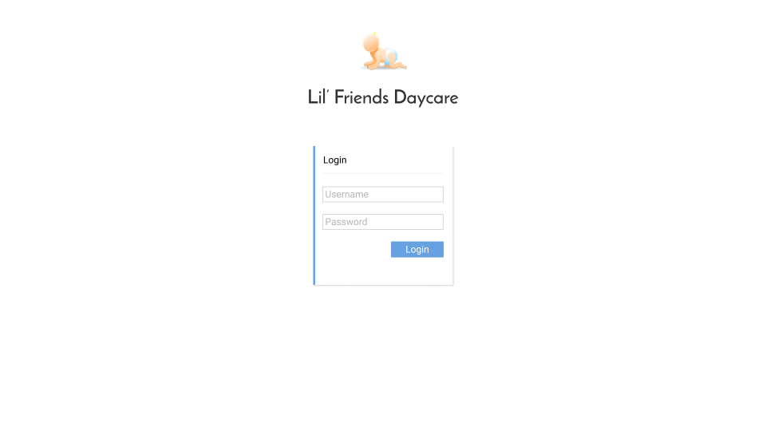
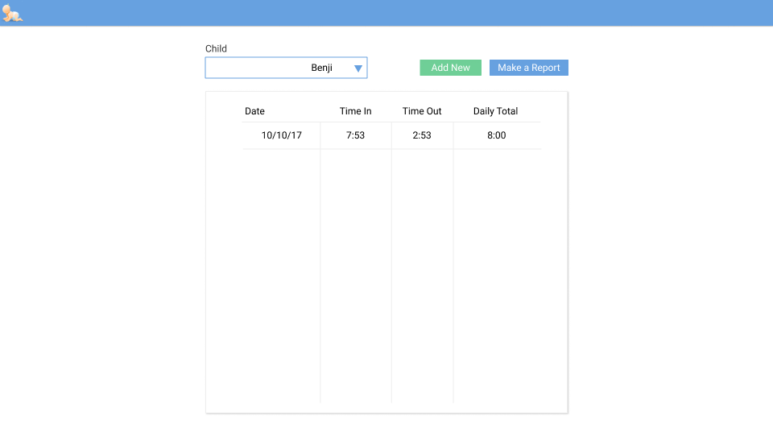

# LFDC (Lil Friends Daycare)
This is a school project that I am using to build a small application that will allow a daycare to log in and out times for their clients

## Goals
This assignment must meet the requirements laid out by the instructor

- [ ] Must be written in one of the following languages
  - [ ] php
  - [ ] C#
  - [ ] Java
  - [ ] C
- [ ] Each week provide an progress update
- [ ] Document the use all of the following concepts:
  - [ ] Variables
  - [ ] File Input
  - [ ] File Output
  - [ ] Sequence
  - [ ] Selection
  - [ ] Repetition
  - [ ] Boolean Logic
  - [ ] Arrays
  - [ ] Functions
  - [ ] Coupling
  - [ ] Cohesion

## Design
Login Page  

Time Tables  

## Week 1
- Project started
- Implemented basic routing and project structure
- Implemented basic pug templates to use instead of html

## Week 2 | October 10th
- [ ] Define the full structure of the application and build all the routes
- [ ] Connect to MySQL DB (remote) and build a functioning login page

### Instructions
1. clone this repo using `git clone https://github.com/zafuzi/lfdc`
2. run `php -S localhost:8000` in the cloned repos main directory
3. navigate browser to `localhost:8000`
4. ENJOY!
